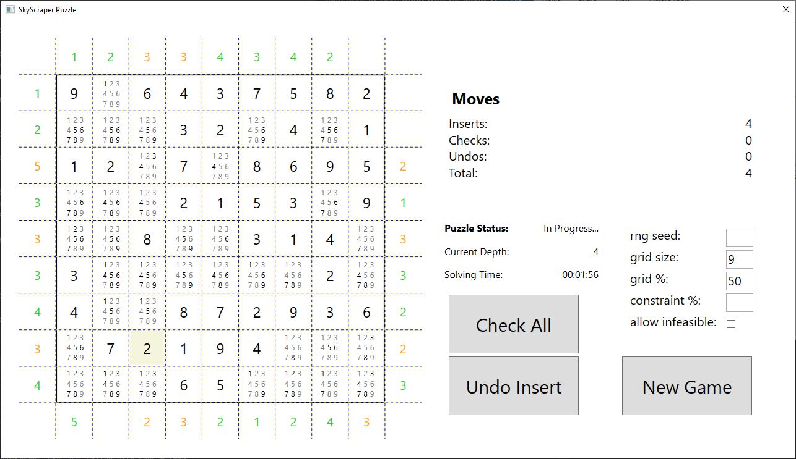
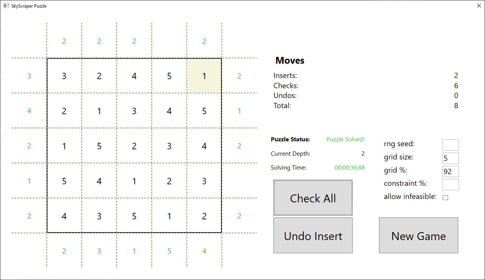
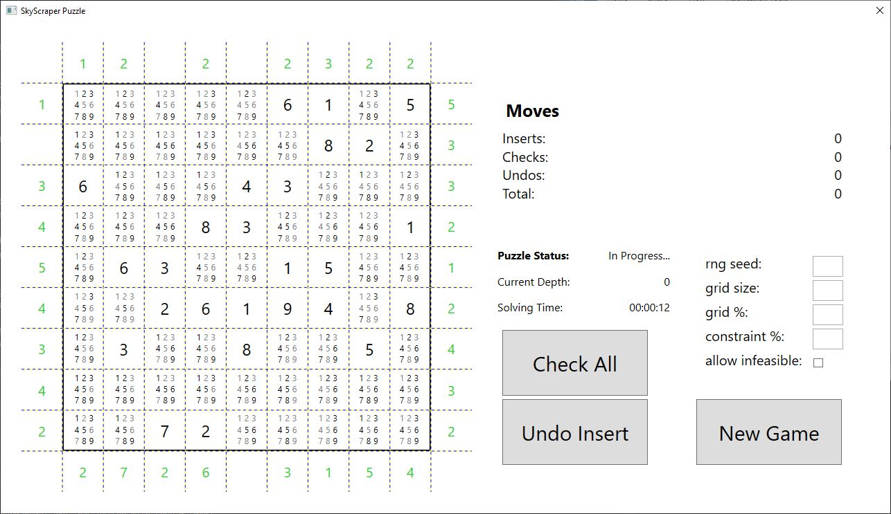
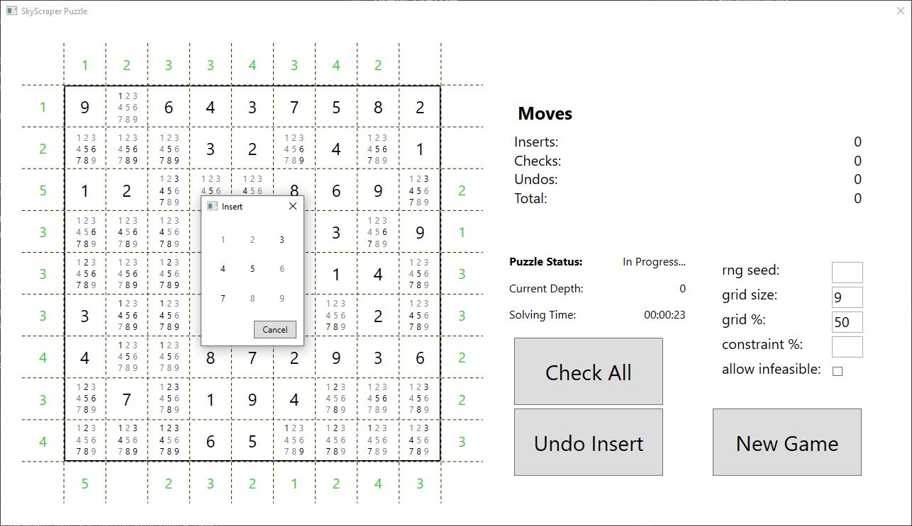

# SkyscraperGame

An offline version of the puzzle game Skyscrapers (see [here](https://www.brainbashers.com/skyscrapers.asp) or [here](https://www.puzzle-skyscrapers.com/)) build with C# using WPF for a graphical user interface.




## Game Objective


The goal is to fill a square grid with numbers between `1` and `size` so that the following conditions are met.

### No Duplicates
Like in Sudoku every column and row contains each number exactly once.

### Skyscraper Condition
Unlike Sudoku, there are no boxes. Instead some rows or columns will have to satisfy "skyscraper conditions".
To understand this condition, one can imagine the puzzle in three dimensions, where the number indicates the height of a "skyscraper" built at that position.

The colored numbers on the outside indicate how many skyscrapers are visible in the given row or column from that position in the completed grid. A skyscraper is visible if and only if there are no taller skyscrapers infront.

Example:

You can see a fully filled puzzle above. For the first row the number on the left is `3` and the numbers in the row from left to right are:

```
      x
    x x
x   x x
x x x x
x x x x x
3 2 4 5 1
```

Thus there are three visible skyscrapers:

```
      x
    x x
x   x x
x x x x
x x x x x
3 _ 4 5 _
```

and the condition is satisfied. From right side perspective, the numbers are in reversed order:

```
  x   
  x x 
  x x   x
  x x x x
x x x x x
1 5 4 2 3
```

Thus only two skyscrapers are visible and the condition is also satisfied:

```
  x   
  x x 
  x x   x
  x x x x
x x x x x
1 5 _ _ _
```

### Game End
A puzzle is completed when:
- when you have filled all cells and no conditions are left to be checked (i.e. all surrounding numbers are green). To check a condition, press on the corresponding number or use the Check All button.
- you proved that the puzzle is infeasible (more on infeasibility below).

## New Game


The game starts with a randomly generated puzzle.
By clicking new Game you can generate a new puzzle, but will be asked to confirm beforehand to avoid accidentally deleting your progress.

There are different settings you can play around with to adapt the difficulty.
You can change the grid size, the number of already set numbers and the number of skyscraper conditions.
By default all puzzles will have a solution. If you want to try out a puzzle that is infeasible, you can check the "Allow Infeasible" box.

Additionally it is possible to generate the same puzzle again, if you set a random seed. This can be useful if you want to share a puzzle with someone else.

## Controls

### Setting a Number / Skyscraper


Left click on a cell to open a dialog to enter a number with your keyboard.
Press the cancel button or any other key to close the dialog without changing anything.

The game automatically tracks valid numbers and does not allow you to enter duplicate numbers in a row or column,
additionally numbers that have already been proved to be invalid will not be allowed either.
However the Skyscraper condition will only be checked when you request so explicitely.

### Checking a Skyscraper condition
Click on the surrounding cells to check if that particular Skyscraper condition can still be satisfied, if not,
you have to undo your moves until you reach a feasible state again.
Once you insert a number, the surrounding cells (which start out green) change color to reflect the new information.
For convenience, there is the "Check All" button to check all outstanding conditions.

### Undo Moves
You can undo your moves one by one, either by clicking the undo button, or by pressing Escape or Backspace.

## Installation

The program is available as a standalone executable (on Windows x64-86), which can be downloaded from the releases.
You can also use VisualStudio or dotnet to build the program yourself, by cloning the repository and building the solution contained in dotnet_solution with Visual Studio or running dotnet build in the terminal.

## Work in Progress

### Loading and Saving

In the future it will be possible to save and load games. And share puzzles with others.

## Automatic solving

A automatic solver is in development. Also take a look [here](https://github.com/TonyCongqianWang/42HeilbronnCPiscine/tree/main/SkyscraperSolver) for a solver written C with a command line interface.
