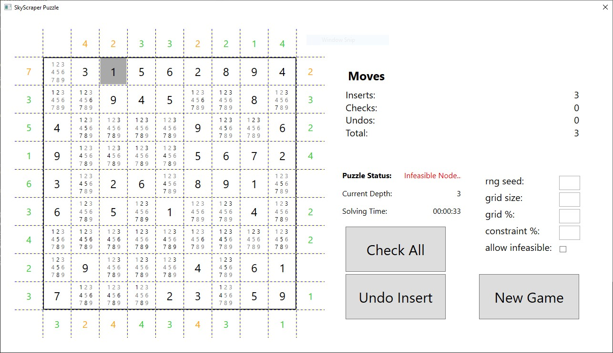
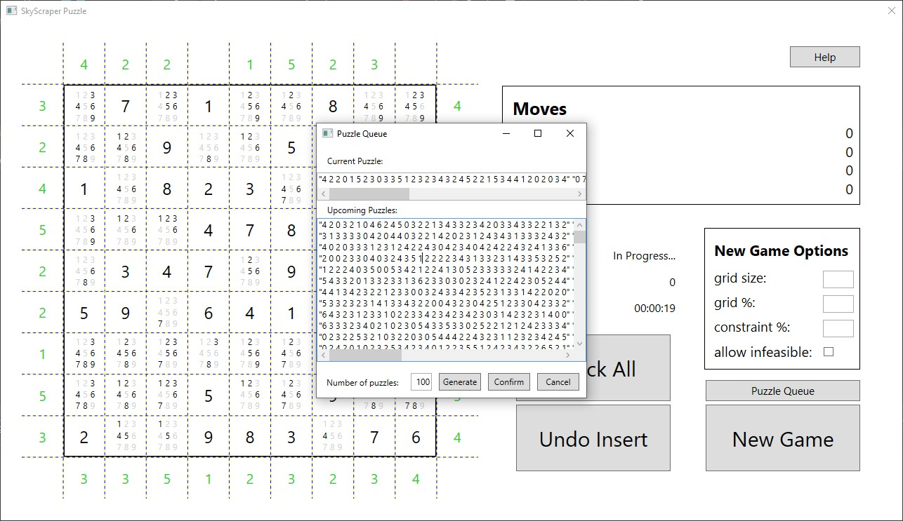

# SkyscraperGame

An offline version of the puzzle game Skyscrapers built with C# using WPF for a graphical user interface. You can find an online version of the game
[here](https://www.brainbashers.com/skyscrapers.asp) or [here](https://www.puzzle-skyscrapers.com/).


## Game Objective


The goal is to fill a square grid with numbers between `1` and `size` so that the following conditions are met:

#### No Duplicates
Like in Sudoku every column and row contains each number exactly once.

#### Skyscraper Condition
Unlike Sudoku, there are no boxes. Instead some rows or columns will have to satisfy "skyscraper conditions".
To understand this condition, one can imagine the puzzle in three dimensions, where the number indicates the height of a "skyscraper" built at that position.

The colored numbers on the outside indicate how many skyscrapers are visible in the given row or column from that position in the completed grid.
A skyscraper is visible if and only if there are no taller skyscrapers in front.

#### Skyscraper Condition Example

You can see a fully filled puzzle above. For the first row the number on the left is `3` and the numbers in the row from left to right are:

```
->        x
->      x x
->  x   x x
->  x x x x
->  x x x x x
    3 2 4 5 1
```

Thus there are three visible skyscrapers:

```
--------> x
------> x x
--> x   x x
--> x x x x
--> x x x x x
    3 _ 4 5 _
```

and the condition is satisfied. From right side perspective, the numbers are in reversed order:

```
->    x   
->    x x 
->    x x   x
->    x x x x
->  x x x x x
    1 5 4 2 3
```

Thus only two skyscrapers are visible and the condition is also satisfied:

```
----> x   
----> x x 
----> x x   x
----> x x x x
--> x x x x x
    1 5 _ _ _
```

### Game End
A puzzle is completed when:
- when you have filled all cells and no conditions are left to be checked (i.e. all surrounding numbers are green). To check a condition, press on the corresponding number or use the Check All button.
- you proved that the puzzle is infeasible (more on infeasibility below).

## New Game


The game starts with a randomly generated puzzle.
By clicking new Game you can generate a new puzzle, but will be asked to confirm beforehand to avoid accidentally deleting your progress.

There are different settings you can play around with to adapt the difficulty.
You can change the grid size, the percentage of cells filled at the start
and the number of skyscraper conditions you need to satisfy (100 means surrounding cells are filled, 0 means no skyscraper conditions).

By default all puzzles will have a solution. If you want to try out a puzzle that is potentially infeasible, you can check the "Allow Infeasible" box.

## Controls

### Setting a Number / Skyscraper


Left click on a cell to open a dialog to enter a number (you can also use your Keyboard).
Press the cancel button or any non-number key to close the dialog without changing anything.

The game automatically tracks valid numbers and does not allow you to enter duplicate numbers in a row or column,
additionally numbers that have already been proved to be invalid will not be allowed either.
However the Skyscraper condition will only be checked when you request so explicitely.

### Checking a Skyscraper condition
Click on the surrounding cells to check if that particular Skyscraper condition can still be satisfied, if not your state will be marked infeasible and
you have to undo your moves until you reach a feasible state again.
Once you insert a number, the surrounding cells (which start out green) change color to reflect the new information.
For convenience, there is the "Check All" button to check all outstanding conditions.

### Undo Moves
You can undo your moves one by one, either by clicking the undo button, or by pressing Escape or Backspace.

## Infeasibility


The game has multiple ways to detect that there is no solution that can be reached from a given state:

- a skyscraper condition is not satisfiable with the given grid.
- there is a cell with no valid numbers
- there is a number `x` for which no cell in a row or column `x` is a valid number.

Once an infeasible state is reached, the only possible action is to undo. The exception is when there is no insert left to undo. In that case the puzzle is completed, since it has been proven that it has no solution.

### Load and Save Puzzles




For now it is not possible to save the entire game state, however it is possible to replay one or multiple puzzles and to share them someone else. 
To do this press the Puzzle Queue button. A dialog will open where the string representation of the current puzzle is shown.
Underneath, there is a textbox where you can input puzzles that you want to play next (one per line).
Press confirm to save the puzzle queue as shown or cancel to return without changing the queue.
When starting a new game, the first puzzle of the queue will be loaded if possible.
Only if there is no (valid) puzzle in the queue left a new puzzle will be randomly generated.
Additionally you can generate new puzzles directly into the queue which allows you to challenge someone to play the same series of puzzles as you.

## Installation

The program is available as a standalone executable (on Windows x64-86), which can be downloaded from the releases.
You can also use VisualStudio or dotnet to build the program yourself, by cloning the repository and building the solution contained in dotnet_solution with Visual Studio or running dotnet build in the terminal.

## Work in Progress

## Automatic solving

A automatic solver is in development. Also take a look [here](https://github.com/TonyCongqianWang/42HeilbronnCPiscine/tree/main/SkyscraperSolver) for a solver written C with a command line interface.
